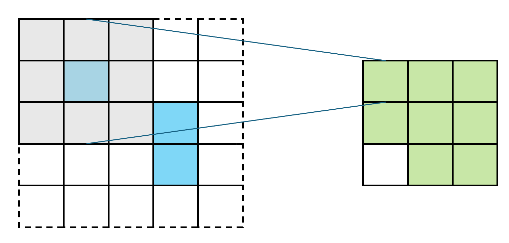
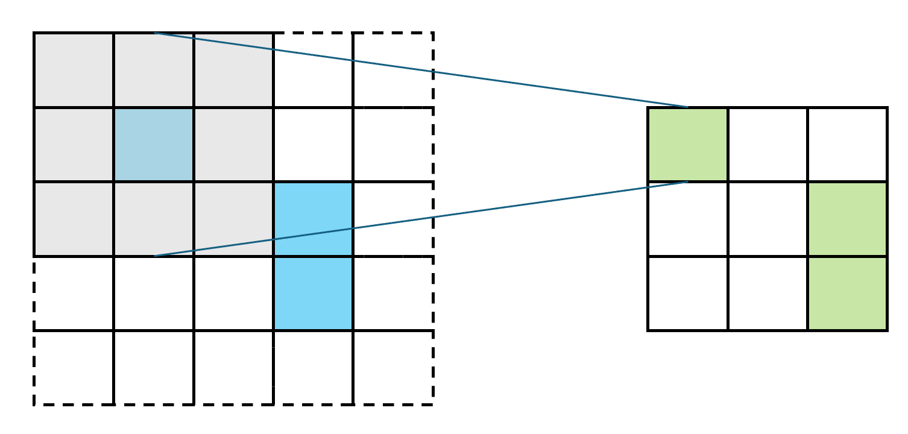

> **Note:** code in preparation, will be packaged, stay tuned:)

  

  
  

# SparsePixels: Efficient convolution for sparse data on FPGAs

## Installation

## Getting Started

## Documentation

## Citation
