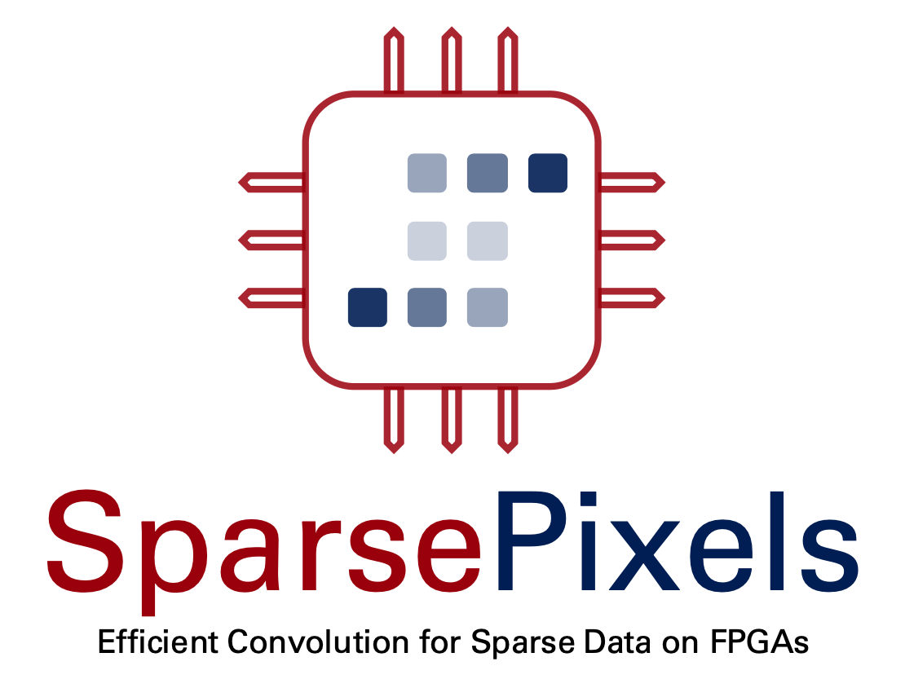
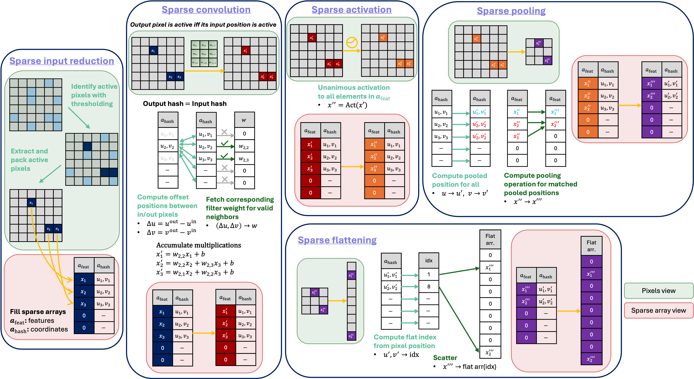
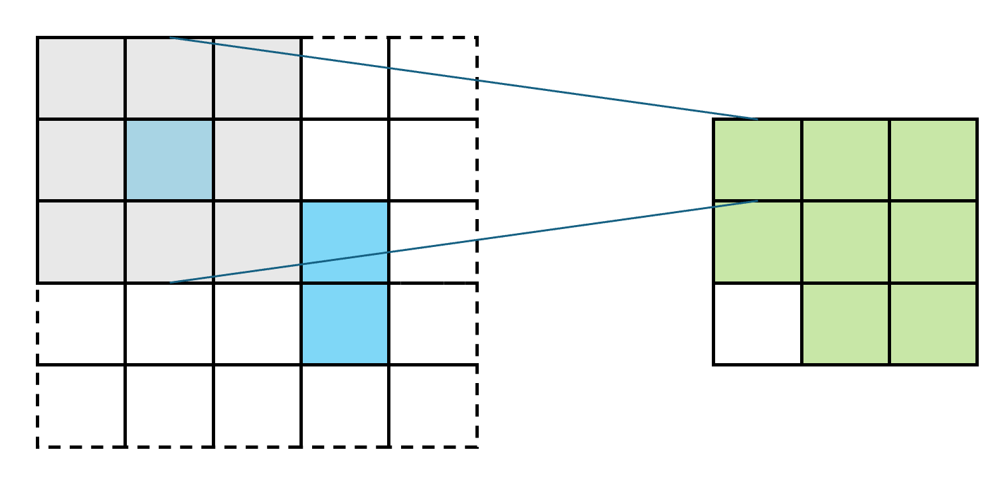
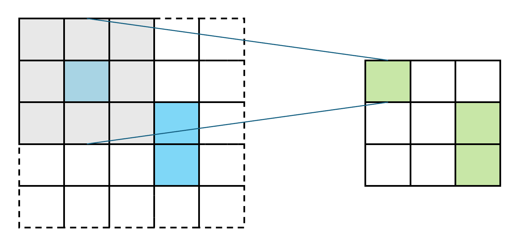

# Welcome to SparsePixels

  

  

  
  

| Docs | Paper | pip |
|:-:|:-:|:-:|
|  |  |  |

## What is SparsePixels?

**SparsePixels builds, trains, and deploys sparse convolutional neural networks that convolve only over the active pixels, so their cost on FPGAs scales with the number of hits rather than the image size.**

In many detectors, especially in high-energy physics experiments, the images are almost empty: only a handful of pixels carry a signal (the hits), yet a standard CNN still spends compute on every pixel. A sparse CNN keeps only the active pixels and convolves around them, which is what makes low-latency, real-time inference (for example in a trigger) feasible on an FPGA.

It is built on Keras 3, using [HGQ2](https://github.com/calad0i/HGQ2) for quantization. The entry point, `InputReduce`, keeps the first `n` active pixels above a `threshold` and passes only those pixels to the rest of the network. Both `n` and the `threshold` are learned from data rather than tuned by hand, with hardware-aware penalties that push the model toward the fewest pixels the task can tolerate. The sparse convolution and pooling layers then run directly on that short list of active pixels, so the compute scales with the number of hits instead of the image size. Once a model is trained, it converts to FPGA firmware through [hls4ml](https://github.com/fastmachinelearning/hls4ml) with per-layer control over how much of each layer runs in parallel. The whole design is centered on the HLS implementation, and the training library is built to reproduce that firmware bit for bit, so what you train is what runs on the chip.

## Navigation

| I want to... | Go to |
|---|---|
| Understand the idea | [Overview](overview.md) |
| Install the package | [Installation](install.md) |
| Build and train a toy model | [Quick Start](quick_start.md) |
| Read the loss breakdown and tune the penalties | [Training & Monitoring](training.md) |
| Convert a trained model to FPGA firmware | [HLS Conversion](conversion.md) |
| Look up every layer and utility | [API Reference](api.md) |
| See the full workflow end to end | [Sparse MNIST demo](demo/notebooks/sparse_mnist.ipynb) |
