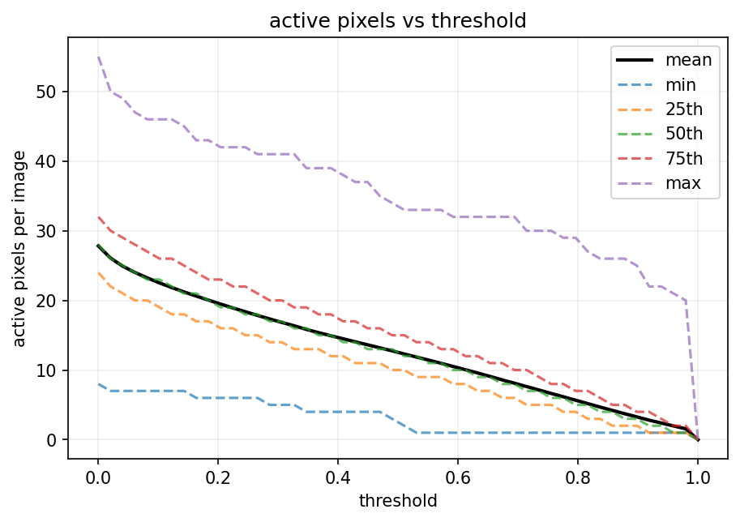
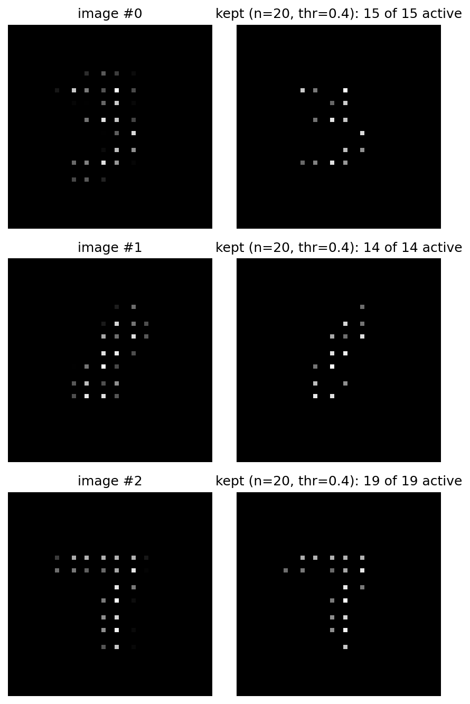
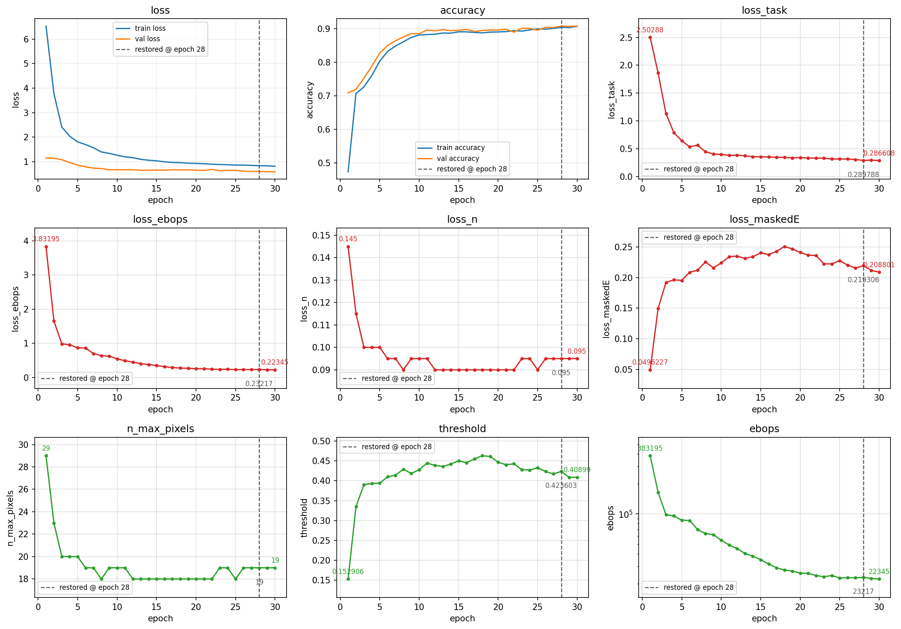
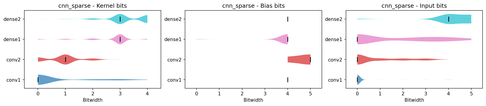

# Training & Monitoring

Training a sparse model has more moving parts than a plain classifier: a learnable pixel budget, a learnable threshold, and quantized bit-widths, each with its own penalty. Our built-in tools make all of it visible so you can see what the model is doing and steer it.

## Before you train

Start by looking at the data, so you can pick a sensible starting point for the pixel budget `n` and the `threshold`. `active_pixels_vs_threshold` scans a range of thresholds and reports how many pixels stay active per image (mean, min, max, and a few percentiles):

``` python
from sparsepixels.utils import active_pixels_vs_threshold, plot_reduced_examples

active_pixels_vs_threshold(x_train)
```

{ width="70%" }

At the threshold you have in mind, read a high percentile or the max to see how many pixels the busiest images carry, and set the initial `n` a little above that so nothing important is dropped on day one. `plot_reduced_examples` then shows exactly what a candidate `(n, threshold)` keeps on a few images, so you can check the digits (or hits) survive:

``` python
plot_reduced_examples(x_train, n=20, threshold=0.3, n_examples=3)
```

{ width="90%" }

## The monitor

Add `SparseTrainingMonitor` to `model.fit`'s callbacks. Each epoch it records into the history the current budget and threshold of the `InputReduce` layer (`n_max_pixels`, `threshold`), the total `ebops`, and the loss split into its parts (below). It also applies the sparse EBOPS correction at the start of training, so the reported cost and the regularizer reflect the sparse compute without any manual call.

``` python
history = model.fit(..., callbacks=[early_stop, SparseTrainingMonitor()])
plot_history(history, early_stopping=early_stop)
```

## Reading the loss breakdown

Every penalty is already scaled by its weight, so the parts add up to the total loss:

`loss = loss_task + loss_ebops + loss_n + loss_maskedE`

| Term | What it is |
|------|-----------|
| `loss_task` | the classification (or regression) loss |
| `loss_ebops` | the EBOPS regularizer, `beta0 * ebops`, which shrinks the quantized bit-widths |
| `loss_n` | the budget penalty, `beta_n * n`, which drives the pixel budget down |
| `loss_maskedE` | the masked-intensity penalty, which resists throwing away real signal |

`plot_history` draws each of these (in red) next to your metrics, and the sparse diagnostics (`n_max_pixels`, `threshold`, `ebops`, in green), marking the epoch that `EarlyStopping` restored. A full run from the [demo notebook](demo/notebooks/sparse_mnist.ipynb) looks like this, with the budget settling and the threshold rising to a stable value:

{ width="100%" }

## Tuning the penalties

Three weights set how hard the model is pushed toward cheaper hardware, and they trade against accuracy in different ways:

- `beta_n` is the price of a kept pixel. Higher `beta_n` drives the pixel budget `n` smaller.
- `beta_maskedE` is the counterweight. It penalizes the fraction of pixel intensity that gets masked, so it pushes back on anything that discards real signal.
- `beta0` (set in the `LayerConfigScope`) is the price of quantization (defined from HGQ2). Higher `beta0` shrinks the quantized bit-widths through the EBOPS regularizer: cheaper hardware for a little accuracy.

In practice you are balancing `beta_n` and `beta_maskedE` against each other. If the model over-masks, meaning accuracy drops because the threshold climbed too high or `n` fell too far, lower `beta_n` or raise `beta_maskedE`, and start from a larger `n` or a lower `threshold`. If it under-masks, meaning it keeps noise and `n` stays high, do the opposite: raise `beta_n` or lower `beta_maskedE`. The data study above gives you the starting `n` and `threshold`; the penalties then refine them.

!!! tip
    Change one weight at a time and watch the `n_max_pixels`, `threshold`, and validation-accuracy panels in `plot_history`. A healthy run has the budget and threshold levelling off well before the accuracy starts to suffer.

## Quantization summary

After training, inspect the learned bit-widths and per-layer EBOPS:

``` python
from sparsepixels.utils import print_quantization, plot_quantization

print_quantization(model)   # per-layer table of weight, bias and activation bit-widths and EBOPS
plot_quantization(model)    # the same as violin plots
```

{ width="100%" }

Each violin is one layer. Its horizontal spread is the distribution of learned bit-widths across that layer's kernel, bias, and input values, and the vertical line marks the median. It is a quick way to see where the precision, and therefore the hardware cost, is concentrated.

## Deploying the learned values

To retrieve the final pixel budget and threshold after training:

``` python
ir = model.get_layer('input_reduce')
n_to_deploy = ir.n_max_pixels     # integer pixel budget
thr_to_deploy = ir.threshold      # activity threshold
```

The hls4ml converter reads these automatically from the model, so you never pass them by hand. See [HLS Conversion](conversion.md).
